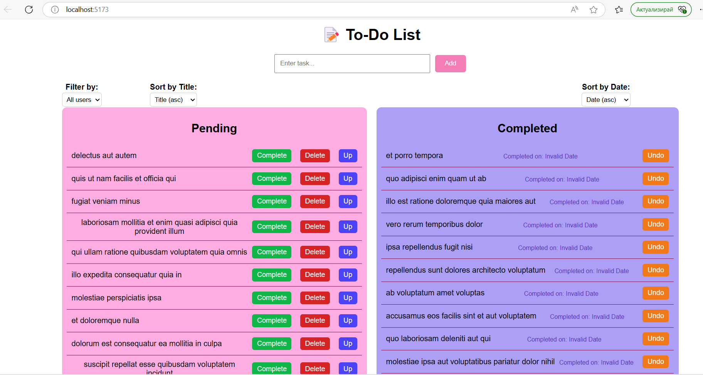

# React To-Do List App

A simple app where you can record the things you need to do.
The app helps you organize your tasks easily.

Preview

  

✨ Main Features

- ➕ Add a task
- ✅ Mark a task as completed
- 🗑️ Delete a task
- ⬆️ Move a task up
- 👤 Filter tasks by user
- 🔤 Sort uncompleted tasks by title
- 🗓️ Sort completed tasks by completion date

### Prerequisites

Before running the app locally, make sure you have the following installed on your machine:

- [Node.js](https://nodejs.org/) (version-22.14.0)
- [npm](https://www.npmjs.com/) (comes with Node.js)

🚀 How to Run the Project

1. Clone the repository:

git clone https://github.com/nnezirova/ToDoList.git
cd my-react-app

2. Install dependencies:

npm install

3. Start the development server:

npm start

or if you prefer:

npm run dev

### Running the App Locally

To start the app locally:

1. In the project directory, run the following command to start the development server:
    npm start

2. Open your browser and navigate to `http://localhost:5173` to view the app running locally

### Additional Configuration Steps

1. **Set up environment variables (if necessary):**
   If your app requires environment variables (e.g., API keys), create a `.env` file in the root of your project and add the necessary variables.

2. **Fetch data from API:**
   The app fetches To-Do tasks from the API `http://jsonplaceholder.typicode.com/todos` upon startup. You don't need to configure this, as it is handled automatically by the app.

3. **Testing:**
   If you have tests for your app, you can run them using:
    npm test
    
🛠️ Technologies Used

- React
- CSS
- HTML

# React + Vite

This template provides a minimal setup to get React working in Vite with HMR and some ESLint rules.

Currently, two official plugins are available:

- [@vitejs/plugin-react](https://github.com/vitejs/vite-plugin-react/blob/main/packages/plugin-react) uses [Babel](https://babeljs.io/) for Fast Refresh
- [@vitejs/plugin-react-swc](https://github.com/vitejs/vite-plugin-react/blob/main/packages/plugin-react-swc) uses [SWC](https://swc.rs/) for Fast Refresh

## Expanding the ESLint configuration

If you are developing a production application, we recommend using TypeScript with type-aware lint rules enabled. Check out the [TS template](https://github.com/vitejs/vite/tree/main/packages/create-vite/template-react-ts) for information on how to integrate TypeScript and [`typescript-eslint`](https://typescript-eslint.io) in your project.
